# ASH|TECHS
(Developer: Femi Ashiru)


[Live Project](https://ash-techs-a3f0a77bec88.herokuapp.com/)

## Table of Content

- [ASH|TECHS](#ashtechs)
  - [Table of Content](#table-of-content)
  - [Project Goals](#project-goals)
    - [User Goals](#user-goals)
    - [Site Owner Goals](#site-owner-goals)
  - [User Experience](#user-experience)
    - [Target Audience](#target-audience)
    - [User Requirements and Expectations](#user-requirements-and-expectations)
    - [User Stories](#user-stories)
      - [First-time User](#first-time-user)
      - [Returning User](#returning-user)
      - [Site Owner](#site-owner)
  - [Scope](#scope)
  - [Design](#design)
    - [Design Choices](#design-choices)
    - [Colour](#colour)
    - [Fonts](#fonts)
    - [Structure](#structure)
      - [What links users can and cannot see:](#what-links-users-can-and-cannot-see)
    - [Database Structure](#database-structure)
    - [MongoDB Collections](#mongodb-collections)
    - [Wireframes](#wireframes)
  - [Technologies Used](#technologies-used)
    - [Languages](#languages)
    - [Frameworks and Tools](#frameworks-and-tools)
  - [Features](#features)
    - [Logo Navigation and Search bar](#logo-navigation-and-search-bar)
    - [Movie Section](#movie-section)
    - [Footer](#footer)
    - [Sign In](#sign-in)
    - [Register](#register)
    - [Profile](#profile)
    - [Add Movie](#add-movie)
    - [Edit Movie](#edit-movie)
    - [Delete Movie](#delete-movie)
    - [Add Review](#add-review)
    - [Edit Review](#edit-review)
    - [Delete Review](#delete-review)
    - [Manage Genres](#manage-genres)
    - [Delete User](#delete-user)
    - [404 Page](#404-page)
    - [500 Page](#500-page)
  - [Validation](#validation)
    - [HTML Validation](#html-validation)
    - [CSS Validation](#css-validation)
    - [JS Validation](#js-validation)
    - [Python Validation](#python-validation)
    - [Accessibility](#accessibility)
    - [Performance](#performance)
    - [Performing tests on various devices](#performing-tests-on-various-devices)
    - [Browser compatibility](#browser-compatibility)
    - [Responsiveness](#responsiveness)
    - [Testing user stories](#testing-user-stories)
  - [Bugs](#bugs)
  - [Deployment](#deployment)
  - [Credits](#credits)
    - [Media](#media)
    - [Code](#code)
  - [Acknowledgements](#acknowledgements)


## Project Goals 

### User Goals
- See all movies added to MCC.
- To see reviews of all movies.
- To add movies to MCC.
- To add reviews to movies.

### Site Owner Goals
- To allow users to sign up to MCC.
- To manage the genres on MCC.
- To manage users accounts on MCC.

## User Experience

### Target Audience
- People who are fans of films. 
- People who are part of a physical film club.
- To be a central place for movie fans to share their reviews.

### User Requirements and Expectations

- Easy to use navigation that is responsive.
- Be able to easily browse between sections of the site.
- All links to work as expected.
- Appealing design that works well on both desktop and mobile devices.
- Be able to log in and upload a movie of their choice.
- Be able to add reviews to all movies on the site if logged in.
- Be able to edit/delete users own movies.
- Be able to edit/delete users own reviews.
- All users to be able to search for movies using a search bar feature.
- All users to be able to see movies and reviews
- Accessibility.

### User Stories

#### First-time User 
1. I want to see all movies on MCC.
2. I want to create an account on MCC.
3. I want to add movies on MCC.
4. I want to add reviews on MCC.

#### Returning User
5. I want to log into my MCC account.
6. I want to edit movies on MCC.
7. I want to edit reviews on MCC.
8. I want to delete my movies on MCC.
9. I want to delete my reviews on MCC.
10. I want to use the search bar to search movies on MCC.
11. I want to delete my account if no longer needed.

#### Site Owner 
12. I want all users to be able to see all movies.
13. I want all users to be able to see all reviews.
14. I want all users to be able to create an account.
15. I want users who have created accounts to log in and see their profile.
16. I want account users to add a movie.
17. I want account users to edit their own movie.
18. I want account users to delete their own movie.
19. I want account users to add reviews.
20. I want account users to edit their own review.
21. I want account users to delete their own review.
22. I want to be able to log in as admin.
23. I want to be able to add a genre.
24. I want to be able to edit a genre.
25. I want to be able to delete a genre.
26. I want to be able to prompt account users before updating or deleting.
27. I do not want users to use browser back button if they are looking for a page that does not exist.

## Scope

The scope of the project in its first release is defined by the following features:

- Simple navigation that allows user to navigate between sections of the site. 
- Allow users to log into their own accounts and perform CRUD operations on movies and reviews associated to the moviews as well as their own account. Admin users should also be able to perform CRUD operations on genres and on the users with accounts.
- Allow all users to see the stored movies and reviews.
- Allow all users to search all the movies that have been added.
- Allow visitors to create an account as well as delete it if no longer needed.
- An error page (404.html) and internal server error page (500.html) that appears when visiting a page that does not exist or when an internal server error has been detected.
- Clear and simple favicon icon to help users identify the site.
- Navigation links to show and hide based on logged in and logged out users as well as admin and non-admin users 

Features to be built in future releases:

- Allow admin to review movie submissions to check whether a movie has already been added or not. Some movies over time have had the same title name so an extra field in the Movies collection that will signify approval that will alert admin so that they can approve it or not.
- Further development to allow admin users to have super user controls and delete reviews and movies.
- Ability for users to add a list of Actors to be submitted into the Movies collection.
- Users to create groups which they can add other users to.

## Design

### Design Choices
MMC was designed to mimic the look and feel of iMdb. It was very much styled on that basis however the layout is very simple so that users can accurately locate all the necesarry sections of the site with ease. The majority of the site is styled using Materialize components which has helped the site keep a consistent structure and made it fully responsive also. As alot of the images used are being generated from OMDbs api the site colours and layout need to be kept simple. My attempt with this was to see if I could essentially make the design an iMdb/Netflix clone.

### Colour

For the colour scheme I opted to base it on the colour scheme of iMdB.


### Fonts

The main font used in the entirety of the website is "'Roboto', sans-serif". For the logo I opted for 'Bebas Neue', sans-serif which has a similar look to the iMdb logo. Both fonts were imported using Google Fonts API.

### Structure
The site has a total of 14 pages each having certain restrictions based on who is logged in. The entire site is fully responsive and has been tested within the industry standard width of 320px.

The website consists of 14 main pages:
- Main page which shows all movies stored, giving all users the ability to see details and reviews.
- Sign in page that allows returning users to log in to their account.
- Register page that allows visitors to the site to set up their own new accounts.
- Profile page that allows logged in users to see and edit their movies as well as delete their own account. Admin user can also see all the users with accounts and delete them.
- Add and edit movie pages which are only accessible to logged in users.
- Add and edit review pages which are only accessible to logged in users.
- Manage genere page which allows the admin user to see all genres stored and delete them.
- Add and edit genre pages which are only accessible to admin user.


Using Figma I created a conceptual flow chart of how users will navigate throughout the site.


#### What links users can and cannot see:

- All users:
    - Home, Sign In, Register
- Logged in (non-admin user)
    - Home, Profile, Add Movie, Sign Out
- Logged in (admin user)
    - Home, Profile, Add Movie, Manage Genres, Sign Out

- Logged in users can only edit and delete their own reviews and movies.

### Database Structure

Using Lucid chart I created an ERD to show how data will flow and be stored within MongoDB collections.


### MongoDB Collections

<p>Genres</p>

"_id":{"$oid":"UNIQUE_ID"},

"genre_name":"Comedy"

<p>Movies</p>


"_id":{"$oid":"UNIQUE_ID"},

"genre_name":"Comedy",

"title":"Rush Hour",

"year":{"$numberInt":"1998"},

"plot":"When a Chinese diplomat's daughter is kidnapped in Los Angeles, he calls in Hong Kong Detective Inspector Lee (Jackie Chan) to assist the FBI with the case. But the FBI doesn't want anything to do with Lee, and they dump him off on the LAPD, who assign wisecracking Detective James Carter (Chris Tucker) to watch over him. Although Lee and Carter can't stand each other, they choose to work together to solve the case on their own when they figure out they've been ditched by both the FBI and police.",

"rating":{"$numberInt":"89"},

"director":"Brett Ratner",

"poster":"IMAGE_FROM_OMDB_API",

"created_by":"USER"

<p>Reviews</p>

"_id":{"$oid":"UNIQUE_ID"},

"review":"This movie is really funny. I laughed from start to finish.",

"title":"Rush Hour",

"created_by":"USER"

<p>Users</p>

"_id":{"$oid":"UNIQUE_ID"},

"username":"CHOSEN_USERNAME",

"password":"HASHED_PASSWORD"


### Wireframes

<details><summary>movies</summary>

</details>
<details><summary>add_movie</summary>

</details>
<details><summary>edit_movie</summary>

</details>
<details><summary>reviews</summary>

</details>
<details><summary>add_review</summary>

</details>
<details><summary>edit_review</summary>

</details>
<details><summary>genres</summary>

</details>
<details><summary>add_genre</summary>

</details>
<details><summary>edit_genre</summary>

</details>
<details><summary>sign_in</summary>
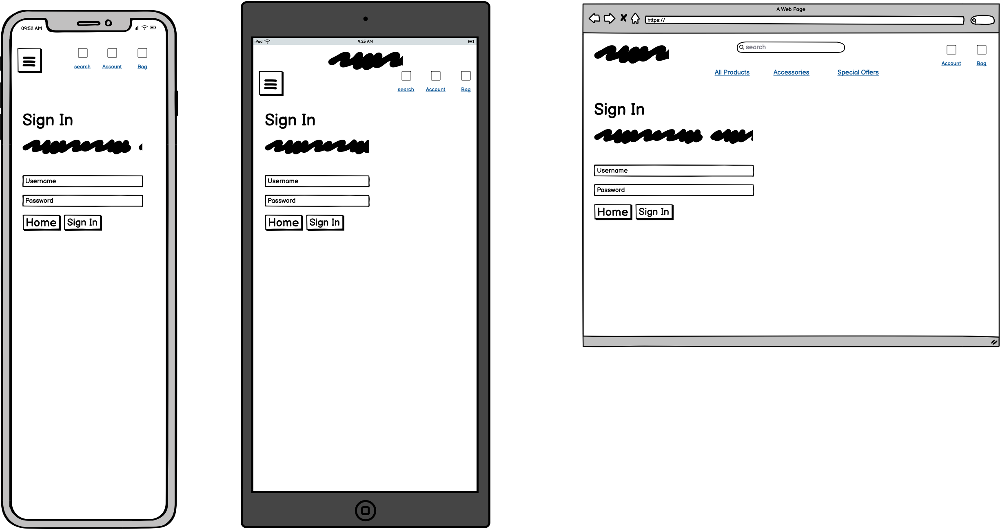
</details>
<details><summary>register</summary>
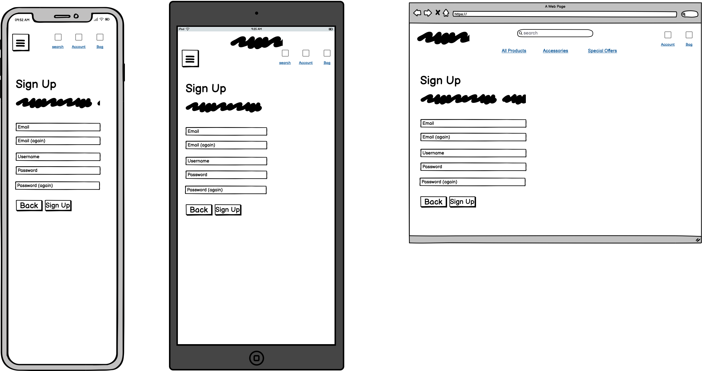
</details>
<details><summary>profile</summary>
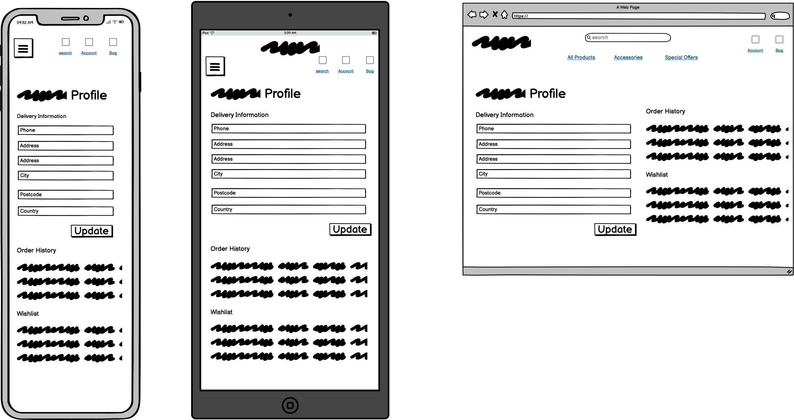
</details>
<details><summary>404</summary>

</details>
<details><summary>500</summary>

</details>


## Technologies Used

### Languages
- HTML
- CSS
- JavaScript
- Python

### Frameworks and Tools
- Django
- AWS
- Bootstrap
- ElephantSQL
- Git
- GitHub
- CodeAnywhere
- Balsamiq
- Figma
- Google Fonts
- Adobe Color
- Font Awesome
- Favicon<span>.</span>io

## Features

### Logo Navigation and Search bar
- Navigation and Logo remains consistent on each page
- Navigation and search bar are fully responsive and collapse when window is resized
- Navigation allows users to easily navigate the site and search bar allows users to search movies (User story 10)
- Logo in Navigation takes user back to the main page

<p>Nav on Desktop, tablet and mobile</p>


<p>Search Bar</p>


### Movie Section
- Displays all movies uploaded, with choice to leave review, edit or delete movie  (User story 1)


### Footer
- Displays logo, copyright and social links 


### Sign In
- Allows users to sign into their own account  (User Story 5, 14, 15)


### Register
- Allows users to register with MCC  (User Story 2, 14)

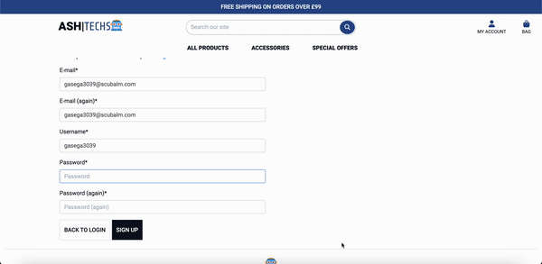

### Profile
- Allow users to see their own profile (User Story 15)

<p>Admin</p>


<p>Non-admin User</p>


### Add Movie
- Allows users to add a movie (User Story 3, 16)


### Edit Movie
- Allows users to edit their own movie  (User Story 6, 17, 26)


### Delete Movie
- Allows users to delete their own movie  (User Story 8, 18, 26)


### Add Review
- Allows users to see and add reviews (User Story 4, 13, 19)


### Edit Review
- Allows users to edit reviews (User Story 7, 20, 26)

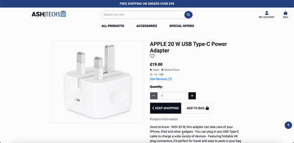

### Delete Review
- Allows users to delete their own review  (User Story 9, 21, 26)

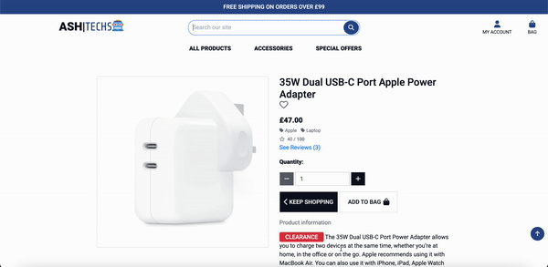

### Manage Genres
- Allow user (admin) to see, add and edit genres (User Story 23, 24, 25, 26)


### Delete User
- Allow user to delete their account (User Story 11, 26)


### 404 Page
- Users should be presented with a 404 page if they visit an incorrect page (User Story 27)


### 500 Page
- Users should be presented with a 500 page if there are any server issues


## Validation

### HTML Validation
The W3C Markup Validation Service was used to validate the HTML of the website. 
In order to test some of the HTML validation links you must be logged in.

index.html(Home) [results](https://validator.w3.org/nu/?doc=https%3A%2F%2Fash-techs-a3f0a77bec88.herokuapp.com%2F) - No Errors Found

products.html [results](https://validator.w3.org/nu/?doc=https%3A%2F%2Fash-techs-a3f0a77bec88.herokuapp.com%2Fproducts%2F) - No Errors Found

add_product.html [result](https://validator.w3.org/nu/?doc=https%3A%2F%2Fash-techs-a3f0a77bec88.herokuapp.com%2Fproducts%2Fadd_product) - No Errors Found

edit_product.html [result](https://validator.w3.org/nu/?doc=https%3A%2F%2Fash-techs-a3f0a77bec88.herokuapp.com%2Fproducts%2Fedit_product%2F19) - No Errors Found

product_details.html [result](https://validator.w3.org/nu/?doc=https%3A%2F%2Fash-techs-a3f0a77bec88.herokuapp.com%2Fproducts%2F3%2F) - No Errors Found

add_review.html [result](https://validator.w3.org/nu/?doc=https%3A%2F%2Fash-techs-a3f0a77bec88.herokuapp.com%2Freviews%2Fadd_review%2F3) - No Errors Found

update_review.html [result](https://validator.w3.org/nu/?doc=https%3A%2F%2Fash-techs-a3f0a77bec88.herokuapp.com%2Freviews%2Fupdate_review%2F45) - No Errors Found

profile.html [result](https://validator.w3.org/nu/?doc=https%3A%2F%2Fash-techs-a3f0a77bec88.herokuapp.com%2Fprofile%2F) - No Errors Found

bag.html [result](https://validator.w3.org/nu/?doc=https%3A%2F%2Fash-techs-a3f0a77bec88.herokuapp.com%2Fbag%2F) - No Errors Found

checkout.html [result](https://validator.w3.org/nu/?doc=https%3A%2F%2Fash-techs-a3f0a77bec88.herokuapp.com%2Fcheckout%2F) - No Errors Found

- To check the test for checkout_success.html please ensure that you use an order number from your own order history and replace the current one in the link

checkout_success.html [result](https://validator.w3.org/nu/?doc=https%3A%2F%2Fash-techs-a3f0a77bec88.herokuapp.com%2Fcheckout%2Fcheckout_success%2FC3E5AFDC463244CBA8BD9F780EA55F1B) - No Errors Found

403.html, 404.html and 500.html mirror index.html and have been tested manually by adding the text input directly with no errors


### CSS Validation
The W3C Jigsaw CSS Validation Service was used to validate the CSS of the website.
After testing the whole sites CSS and my own custom CSS all pages passed with no errors, however, there were a number of warnings present that were related to the webkit css extensions used.

whole site [results](https://jigsaw.w3.org/css-validator/validator?uri=https%3A%2F%2Fmovie-crazy-club-73ece9687233.herokuapp.com%2F&profile=css3svg&usermedium=all&warning=1&vextwarning=&lang=en) - 1 Error found in the materialize.min.css

custom css [results](https://jigsaw.w3.org/css-validator/validator?uri=https%3A%2F%2Fmovie-crazy-club-73ece9687233.herokuapp.com%2Fstatic%2Fcss%2Fstyle.css&profile=css3svg&usermedium=all&warning=1&vextwarning=&lang=en) - No Errors Found

### JS Validation

[JS Hint](https://jshint.com/) was used to validate the JavaScript of the website.

<details><summary>script.js</summary>
<p>One undefined variable called M which is being used by Materialize Javascript initialisation.</p>

</details>

<details><summary>register.js</summary>

</details>

<details><summary>drop_down_validator.js</summary>

</details>

<details><summary>in_html_script located in add_movie.html and edit_movie.html</summary>
<p>One unused variable warning however it is used within fetch_movie_poster.js document. It has to be called in the HTML file in order for it to be recognised by Jinja. </p>

</details>

<details><summary>fetch_movie_poster.js</summary>
<p>One undefined variable warning however it is defined within in script for add and edit movie pages to hide api key</p>

</details>

<details><summary>character_count.js</summary>

</details>


### Python Validation

[Python Linter](https://pep8ci.herokuapp.com/) was used to test and validate the Python used in app.py

- app.py - No Errors


### Accessibility
The WAVE WebAIM web accessibility tool was used to ensure the website met accessibility standards. 

movies.html [results](https://wave.webaim.org/report#/https://movie-crazy-club-73ece9687233.herokuapp.com/show_movies) - No Errors Found.

reviews.html [results](https://wave.webaim.org/report#/https://movie-crazy-club-73ece9687233.herokuapp.com/show_reviews/64aa76200062b2ede6c081c1) - No Errors Found

sign_in.html [results](https://wave.webaim.org/report#/https://movie-crazy-club-73ece9687233.herokuapp.com/sign_in) - No Errors Found.

register.html [results](https://wave.webaim.org/report#/https://movie-crazy-club-73ece9687233.herokuapp.com/register) - No Errors Found.

404.html [results](https://wave.webaim.org/report#/https://movie-crazy-club-73ece9687233.herokuapp.com/profilesdfd) - No Errors Found.

500.html [results](https://wave.webaim.org/report#/https://movie-crazy-club-73ece9687233.herokuapp.com/search) - No Errors Found.

### Performance 
Google Lighthouse Tool was used to test the performance of the website. 
<details><summary>movies</summary>

</details>
<details><summary>reviews</summary>

</details>
<details><summary>genres</summary>

</details>
<details><summary>sign_in</summary>

</details>
<details><summary>register</summary>

</details>
<details><summary>profile</summary>
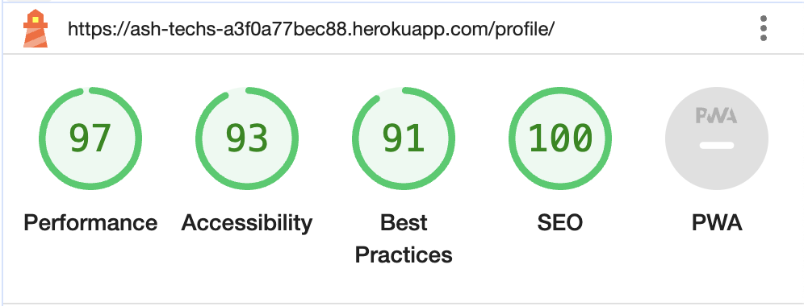
</details>
<details><summary>add_movie</summary>

</details>
<details><summary>add_review</summary>
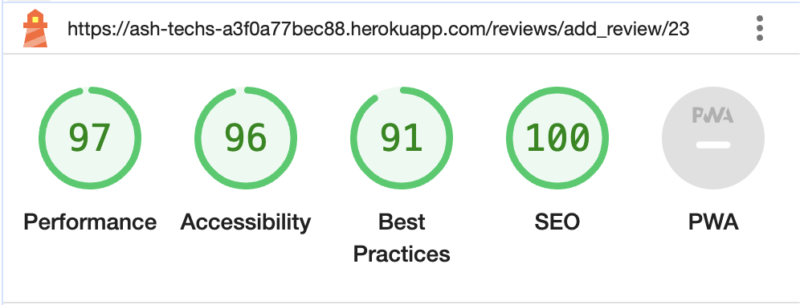
</details>
<details><summary>add_genre</summary>

</details>
<details><summary>edit_movie</summary>

</details>
<details><summary>edit_review</summary>

</details>
<details><summary>edit_genre</summary>

</details>

### Performing tests on various devices 
The website was tested on the following devices:
- Apple MacBook Pro M1
- Apple iPhone 11
- Xiaomi Mi 11 Lite

### Browser compatibility
The website was tested on the following browsers:
- Google Chrome
- Safari
- Mozilla Firefox
- Microsoft Edge

### Responsiveness
The website is completely responsive and has been tested on mobile, tablet and desktop:

<details><summary>Mobile, Tablet and Desktop</summary>

</details>


### Testing user stories

1. I want to see all movies on MCC.

| **Feature** | **Action** | **Expected Result** | **Actual Result** |
|-------------|------------|---------------------|-------------------|
| Movies and Navigation| Click on the home link or logo | show_movies route should be open with all movies display | Works as expected |


2. I want to create an account on MCC.

| **Feature** | **Action** | **Expected Result** | **Actual Result** |
|-------------|------------|---------------------|-------------------|
| Register | Click on register link and enter new details | Correct details should be accepted and profile page with newly created account should appear. Flash message should confirm this. | Works as expected |


3. I want to add movies on MCC.

| **Feature** | **Action** | **Expected Result** | **Actual Result** |
|-------------|------------|---------------------|-------------------|
| Add Movie | Click on Add movie and enter detials of movie | Correct details should be accepted and show_movies page should open with newly added film. Flash message should confirm this.  | Works as expected |


4. I want to add reviews on MCC.

| **Feature** | **Action** | **Expected Result** | **Actual Result** |
|-------------|------------|---------------------|-------------------|
| Reviews | Click on see reviews button, click leave review and enter details | Correct details should be accepted and reviews for specific film should be displayed with newly added review. Flash message should confirm this. | Works as expected |


5. I want to log into my MCC account.

| **Feature** | **Action** | **Expected Result** | **Actual Result** |
|-------------|------------|---------------------|-------------------|
| Navigation, Sign In and Profile| Click on Sign in and enter correct details | Profile should open with logged in user. Flash message should confirm this. | Works as expected |


6. I want to edit movies on MCC.

| **Feature** | **Action** | **Expected Result** | **Actual Result** |
|-------------|------------|---------------------|-------------------|
| Movies and Edit Movie | Click on the edit movie button, enter correct details and click update movie | Edit movie should confirm if user wants to update. Once confirmed it should navigate to the show_movies route displaying updated movie. Flash message should confirm this. | Works as expected |


7. I want to edit reviews on MCC.

| **Feature** | **Action** | **Expected Result** | **Actual Result** |
|-------------|------------|---------------------|-------------------|
| Reviews and Edit Review | Click on the see reviews button, locate user review and click on the edit review button. Update review with correct details and click update review | Edit review should confirm if user wants to update. Once confirmed it should navigate to the show_revies route displaying update review. Flash message should confirm this. | Works as expected |


8. I want to delete my movies on MCC.

| **Feature** | **Action** | **Expected Result** | **Actual Result** |
|-------------|------------|---------------------|-------------------|
| Movies and Delete Movie | Click on the delete movie button | Delete movie should confirm if user wants to delete. Once confirmed it should navigate to the show_movies route with deleted movie no longer present. Flash message should confirm this. | Works as expected |


9. I want delete my reviews on MCC.

| **Feature** | **Action** | **Expected Result** | **Actual Result** |
|-------------|------------|---------------------|-------------------|
| Reviews and Delete Review | Click on see reviews button, locate your review and click delete review button | Delete review should confirm if user wants to delete. Once confirmed it should navigate to the show_reviews route with delete review no longer present. Flash message should confirm this. | Works as expected |


10. I want to use the search bar to search movies on MCC.

| **Feature** | **Action** | **Expected Result** | **Actual Result** |
|-------------|------------|---------------------|-------------------|
| Search Bar | Type search criteria within the search bar | Should navigate to the search route and display relevant movies that match search criteria. Should also display if no match can be found | Works as expected |


11. I want to delete my account if no longer needed.

| **Feature** | **Action** | **Expected Result** | **Actual Result** |
|-------------|------------|---------------------|-------------------|
| Profile and Delete user | Click on the delete account button in profile | Delete user should confirm if user wants to delete. Once confirmed it should delete all associated, movies and reviews as well as their account and finally log the user out | Works as expected |


12. I want all users to be able to see all movies.

| **Feature** | **Action** | **Expected Result** | **Actual Result** |
|-------------|------------|---------------------|-------------------|
| Movies and Navigation| Click on the home link or logo | show_movies route should be open with all movies display | Works as expected |


13. I want all users to be able to see all reviews.

| **Feature** | **Action** | **Expected Result** | **Actual Result** |
|-------------|------------|---------------------|-------------------|
| Reviews | Click on the see reviews button for specific film | show_reviews route should open with selected film and all reviews displayed. | Works as expected |


14. I want all users to be able to create an account.

| **Feature** | **Action** | **Expected Result** | **Actual Result** |
|-------------|------------|---------------------|-------------------|
| Register | Click on register link and enter new details | Correct details should be accepted and profile page with newly created account should appear. Flash message should confirm this. | Works as expected |


15. I want users who have created accounts to log in and see their profile.

| **Feature** | **Action** | **Expected Result** | **Actual Result** |
|-------------|------------|---------------------|-------------------|
| Navigation, Sign In and Profile| Click on Sign in and enter correct details | Profile should open with logged in user. Flash message should confirm this. | Works as expected |


16. I want account users to add a movie.

| **Feature** | **Action** | **Expected Result** | **Actual Result** |
|-------------|------------|---------------------|-------------------|
| Add Movie | Click on Add movie and enter detials of movie | Correct details should be accepted and show_movies page should open with newly added film. Flash message should confirm this.  | Works as expected |


17. I want account users to edit their own movie.

| **Feature** | **Action** | **Expected Result** | **Actual Result** |
|-------------|------------|---------------------|-------------------|
| Movies and Edit Movie | Click on the edit movie button, enter correct details and click update movie | Edit movie should confirm if user wants to update. Once confirmed it should navigate to the show_movies route displaying updated movie. Flash message should confirm this. | Works as expected |


18. I want account users to delete their own movie.

| **Feature** | **Action** | **Expected Result** | **Actual Result** |
|-------------|------------|---------------------|-------------------|
| Movies and Delete Movie | Click on the delete movie button | Delete movie should confirm if user wants to delete. Once confirmed it should navigate to the show_movies route with deleted movie no longer present. Flash message should confirm this. | Works as expected |


19. I want account users to add reviews.

| **Feature** | **Action** | **Expected Result** | **Actual Result** |
|-------------|------------|---------------------|-------------------|
| Reviews | Click on see reviews button, click leave review and enter details | Correct details should be accepted and reviews for specific film should be displayed with newly added review. Flash message should confirm this. | Works as expected |


20. I want account users to edit their own review.

| **Feature** | **Action** | **Expected Result** | **Actual Result** |
|-------------|------------|---------------------|-------------------|
| Reviews and Edit Review | Click on the see reviews button, locate user review and click on the edit review button. Update review with correct details and click update review | Edit review should confirm if user wants to update. Once confirmed it should navigate to the show_revies route displaying update review. Flash message should confirm this. | Works as expected |


21. I want account users to delete their own review.

| **Feature** | **Action** | **Expected Result** | **Actual Result** |
|-------------|------------|---------------------|-------------------|
| Reviews and Delete Review | Click on see reviews button, locate your review and click delete review button | Delete review should confirm if user wants to delete. Once confirmed it should navigate to the show_reviews route with delete review no longer present. Flash message should confirm this. | Works as expected |


22. I want to be able to log in as admin.

| **Feature** | **Action** | **Expected Result** | **Actual Result** |
|-------------|------------|---------------------|-------------------|
| Sign In and Profile | Click sign in and log in as admin | Profile should open that displays other users accounts and Manage genre in the navigation. Flash message should confirm this. | Works as expected |


23. I want to be able to add a genre.

| **Feature** | **Action** | **Expected Result** | **Actual Result** |
|-------------|------------|---------------------|-------------------|
| Manage Genres | Click add genre button, enter the correct details and add genre | show_genres route should appear with newly added genre. Flash message should confirm this. | Works as expected |


24. I want to be able to edit a genre.

| **Feature** | **Action** | **Expected Result** | **Actual Result** |
|-------------|------------|---------------------|-------------------|
| Manage Genres | Click the edit genre button, enter the correct details, and click update genre | Manage genres should confirm if user wants to update genre. Once confirmed it should navigate to the show_genres route with updated genre displayed. Flash message should confirm this. | Works as expected |


25. I want to be able to delete a genre.

| **Feature** | **Action** | **Expected Result** | **Actual Result** |
|-------------|------------|---------------------|-------------------|
| Manage Genres | Click the delete genre button and confirm deletion | Manage genres should confirm if user wants to delete genre. Once confirmed it should navigate to the show_genres route with deleted genre no longer present. All it's associated movies should also be deleted. Flash message should confirm this. | Works as expected |


26. I want to be able to prompt account users before updating or deleting.

| **Feature** | **Action** | **Expected Result** | **Actual Result** |
|-------------|------------|---------------------|-------------------|
| All Update and Delete functionality | Click on update or delete for specific movie, review or genre (admin) | Modal should appear confirming whether user wishes to update/delte item. User has choice to say yes or no | Works as expected |


27. I do not want users to use browser back button if they are looking for a page that does not exist.

| **Feature** | **Action** | **Expected Result** | **Actual Result** |
|-------------|------------|---------------------|-------------------|
| 404 Page | Type in an incorrect route in address bar | 404 template should be rendered with a button navigating to home beneath | Works as expected |


## Bugs

| **Bug** | **Fix** | 
|-------------|------------|
|Not so much of a bug but the OMDB api was shown in the fetch_movie_poster.js and the add/edit movie page which could present a potential security risk| Moved the api key to the env.py, encoded it in base64 within the app.py file and then decoded it when it reached the html within an internal script tag which could then be called in the fetch_movie_poster.js - source used to help with this are detailed in credits|


## Deployment

You can fork the repository by:
1. Navigating to the GitHub repository
2. Click on "Fork" button in top right hand corner (Please note you must be signed in to Fork a repository)

You can clone the repository by:
1. Navigating to GitHub repository 
2. Locate the "Code" button above the file list and click it 
3. Select if you prefer to clone using HTTPS, SSH, or Github CLI and click the copy button to copy the URL to your clipboard
4. Open Git Bash
5. Change the current working directory to where you wish to clone the directory
6. Type ```git clone``` and paste in the URL from the clipboard e.g ```$ git clone https://github.com/YOUR-USERNAME/YOUR-REPOSITORY)```
7. Press Enter to create your local clone in your chosen folder.

Deployed using Heroku using the following steps:
1. You will need to first create the requirements that Heroku will use to import the dependencies. To do so type the following command in your CLI ```pip3 freeze > requirements.txt```

2. You will then need a Procfile which is needed to specify the commands that are executed by the Heroku app on startup. To do so type the following command in your CLI ```echo web: python app.py > Procfile```

3. Be sure to add, commit and push your changes once you have done the above two tasks
4. Within Heroku follow the steps "New" > "Create New App" > Give app a name and choose the relevant region

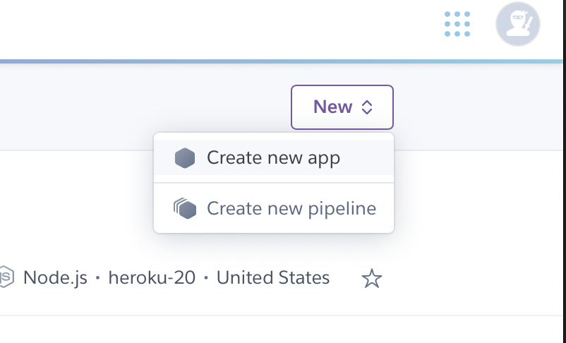
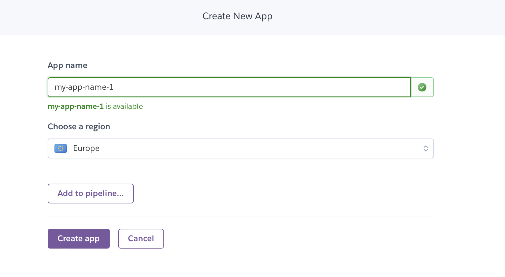

5. The newly created app will open on "Deploy", then follow the steps "Deployment Method" > Select Github and search for the repo-name. Once you have found it, click "Connect" beside the repo-name

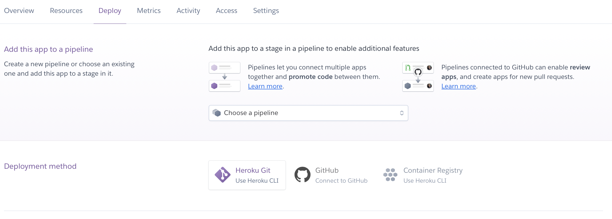
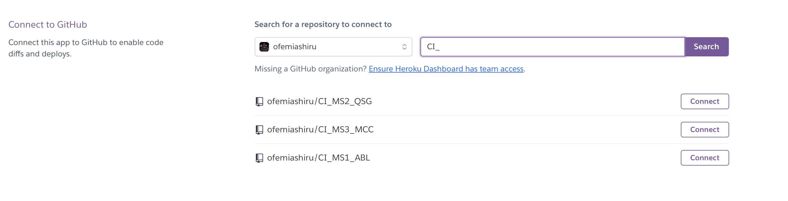

6. Be sure to update the "Config Vars" located in "Settings" > "Config Vars" > "Reveal Config Vars". You will need to set the following variables:
    - IP
    - MONGO_DBNAME
    - MONGO_URI
    - SECRET_KEY
    - OMDB_API_KEY
    - PORT


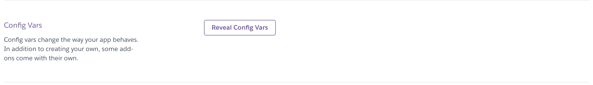

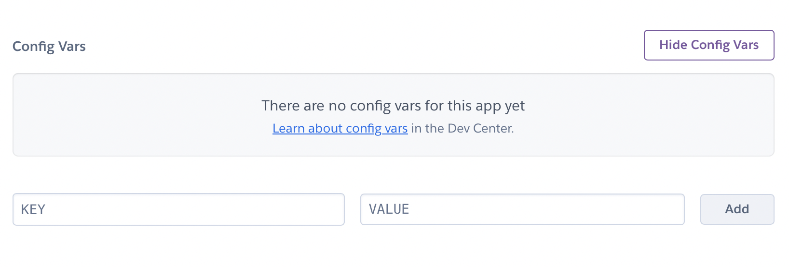

7. Please also be sure to have set your Heroku API key within the Heroku CLI Toolbelt. The API key can be found in "Account Settings" > "Account" > "API Key"


## Credits

### Media

- Movie Wallpaper background | soure: [Wallpapers.com](https://wallpapers.com/)

- All movie poster images are API generated from [OMDb](https://www.omdbapi.com/)

- Image used on add and edit movie pages taken from [Font Awesome](https://fontawesome.com/icons/image?f=classic&s=solid)

### Code

- Used [Flask Documentation](https://flask.palletsprojects.com/en/1.1.x/patterns/errorpages/) to add error routes for 404 and 500

- Used [Code Institute Github Solutions](https://github.com/Code-Institute-Solutions/TaskManagerAuth/blob/main/04-AddingATask-WritingToTheDatabase/02-materialize-select-validation/static/js/script.js) to assist with validating materializes drop down correctly

- Used [Python Basics](https://pythonbasics.org/flask-redirect-and-errors/), [w3schools](https://www.w3schools.com/python/python_regex.asp), [Stack Overflow](https://stackoverflow.com/questions/33467536/how-to-check-if-a-string-is-made-only-of-letters-and-numbers) and [Pythex](https://pythex.org/) for regex and abort class on `valid_object_id` function in app.py

- Used [Geeks for Geeks](https://www.geeksforgeeks.org/encoding-and-decoding-base64-strings-in-python/) and [MDN Web Docs](https://developer.mozilla.org/en-US/docs/Web/API/atob) to encode/decode the OMDB api so it cannot be seen directly in the JS or HTML file

## Acknowledgements

I would like to take the opportunity to thank:
- Mo Shami for continued mentorship, guidance and support throughout this project. 
- Iris Smok for continued encouragement whilst working on this project.
- and all the Teaching and Non-teaching Personnel at Code Institute.