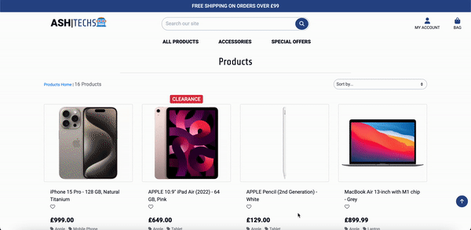
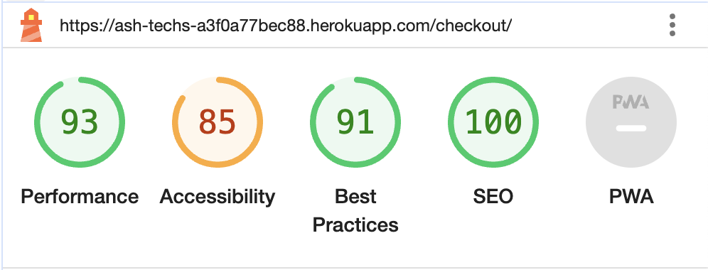
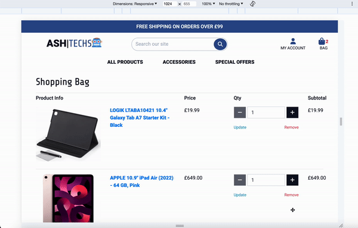

# ASH|TECHS

(Developer: Femi Ashiru)


[Live Project](https://ash-techs-a3f0a77bec88.herokuapp.com/)

- [ASH|TECHS](#ashtechs)
  - [Project Goals](#project-goals)
    - [User Goals](#user-goals)
    - [Site Owner Goals](#site-owner-goals)
  - [User Experience](#user-experience)
    - [Target Audience](#target-audience)
    - [User Requirements and Expectations](#user-requirements-and-expectations)
    - [User Stories](#user-stories)
  - [Scope](#scope)
  - [Design](#design)
    - [Design Choices](#design-choices)
    - [Colour](#colour)
    - [Fonts](#fonts)
    - [Structure](#structure)
      - [What links users can and cannot see](#what-links-users-can-and-cannot-see)
    - [Database Structure](#database-structure)
    - [Wireframes](#wireframes)
  - [Technologies Used](#technologies-used)
    - [Languages](#languages)
    - [Frameworks and Tools](#frameworks-and-tools)
  - [Features](#features)
    - [Logo Navigation and Search bar](#logo-navigation-and-search-bar)
    - [Home](#home)
    - [Footer](#footer)
    - [Sign In](#sign-in)
    - [Register](#register)
    - [Profile](#profile)
    - [Add Product](#add-product)
    - [Edit Product](#edit-product)
    - [Delete Product](#delete-product)
    - [Add Review](#add-review)
    - [Edit Review](#edit-review)
    - [Delete Review](#delete-review)
    - [Bag](#bag)
    - [Checkout](#checkout)
    - [Checkout Success](#checkout-success)
    - [404 Page](#404-page)
  - [Validation](#validation)
    - [HTML Validation](#html-validation)
    - [CSS Validation](#css-validation)
    - [JS Validation](#js-validation)
    - [Python Validation](#python-validation)
    - [Accessibility](#accessibility)
    - [Performance](#performance)
    - [Performing tests on various devices](#performing-tests-on-various-devices)
    - [Browser compatibility](#browser-compatibility)
    - [Responsiveness](#responsiveness)
    - [Testing user stories](#testing-user-stories)
  - [Bugs](#bugs)
  - [Deployment](#deployment)
  - [Credits](#credits)
    - [Media](#media)
    - [Code](#code)
  - [Acknowledgements](#acknowledgements)

## Project Goals

### User Goals

- To see all products within the store.
- To make purchases.
- To see all reviews within the store.
- To leave product reviews.
- To add items to wishlist.

### Site Owner Goals

- To allow users to purchase products.
- To manage the admin of products.

## User Experience

### Target Audience

- People who are interested in purchasing technology products.
- People looking for bargains and deals within tech.

### User Requirements and Expectations

- Easy to use navigation that is responsive.
- Be able to easily browse between sections of the site.
- All links to work as expected.
- Appealing design that works well on both desktop and mobile devices.
- Be able to browse products log in and make a purchase.
- Be able to add reviews to all products if logged in.
- Be able to edit/delete users own reviews.
- Be able to add and remove items from wishlist if logged in.
- All users to b aable to sort and filter down to specific products.
- All users to be able to search for products using a search bar feature.
- All users to be able to see products and reviews.
- Accessibility.

### User Stories

| **Num** | **As an/a** | **I want to be able to** | **So that I can** |
|------------|-------------|--------------------------|-------------------|
|[User Story 1](#user-story-1)|Shopper|See all products|Decide which item to purchase|
|[User Story 2](#user-story-2)|Shopper|See individual product details|See specific details, such as price, quantity, description and review|
|[User Story 3](#user-story-3)|Shopper|Sort and filter products by brand, price, rating and category|See products in ascending and descenging order|
|[User Story 4](#user-story-4)|Shopper|Purchase items from the site|Have the item which I want|
|[User Story 5](#user-story-5)|Shopper|See my recent orders|See history of previous orders|
|[User Story 6](#user-story-6)|Shopper|See, add and remove items from wishlist|See wishlist items in my profile and track what items I want|
|[User Story 7](#user-story-7)|Shopper|Use search bar to search products|Find a specific product|
|[User Story 8](#user-story-8)|Shopper|See all reviews|Make a choice on products based on previous reviews|
|[User Story 9](#user-story-9)|Shopper|Add reviews for specific products|Give opinion on products and help others to make decisions|
|[User Story 10](#user-story-10)|Shopper|Edit or Delete reviews for specific products|Remove or update an incorrectly submitted review|
|[User Story 11](#user-story-11)|Shopper|Easily update products quantity|Buy a certain amount of products|
|[User Story 12](#user-story-12)|Shopper|Receive an email confirmation when I purchase a product|Know that my purchase has been successful|
|[User Story 13](#user-story-13)|Shopper|Update my profile|Add new shipping/billing details to my profile|
|[User Story 14](#user-story-14)|Shopper|Add and Remove Items from my shopping bag|Have greater flexibility over what I purchased|
|[User Story 15](#user-story-15)|Site User|Register to the site|See and edit my profile|
|[User Story 16](#user-story-16)|Site User|Log in and out|Access my personal account information|
|[User Story 17](#user-story-17)|Site User|Receive an email confirmation that I have registered my account|Confirm that I can log in|
|[User Story 18](#user-story-18)|Site Owner|To add products|Have more products on the site|
|[User Story 19](#user-story-19)|Site Owner|To edit products|Correct, update or change a product|
|[User Story 20](#user-story-20)|Site Owner|To delete products|Remove products we no longer sale|

## Scope

The scope of the project in its first release is defined by the following features:

- Simple navigation that allows user to navigate between sections of the site.
- Allow users to log into their own accounts and perform CRUD operations on reviews and make purchases from site utilising Stripe implementation. Admin users should also be able to perform CRUD operations on products.
- Allow all users to see products and reviews for those products.
- Allow all users to search and sort all products.
- Allow visitors to create an account and see their previous orders, wishlist and details on profile.
- An error page (404.html) and internal server error page (500.html) that appears when visiting a page that does not exist or when an internal server error has been detected.
- Clear and simple favicon icon to help users identify the site which is also used as the logo.

Features to be built in future releases:

- Allow admin to add/edit/delete Brands, Categories and User Accounts without accessing Django dashboard.
- Further development to allow Site Users to delete their own account and cancel orders.
- Ability to send an unsuccessful email if something goes wrong with their purchase.
- Allow deals and clearance items to be seen on home page for mobile and tablet.

## Design

### Design Choices

ASHTECHS was designed to mimic the look and feel of popular technonlogy retailer Currys PC World. The layout is a very simple and clean one with little clutter on the page so that users can accurately locate all the necesarry sections of the site with ease. The majority of the site is styled using Bootstrap components and custom CSS which has helped the site keep a consistent structure and made it fully responsive on Mobile and Tablet devices.

### Colour

For the colour scheme I opted for simple yet bold colours. I opted for different shades of blue to represent Business ([Color Theory: Blue as a Branding Color](https://brandingcompass.com/branding/color-theory-blue-as-a-branding-color/)) as well as Loyalty, trust and security. I want Site Users to know that this brand can be trusted and that theme is also represented in the choice of logo taken from [Favicon](https://favicon.io/)


### Fonts

The main font used in the entirety of the website is "'Roboto', sans-serif". For the 'TECH' part of the logo I opted for 'Share Tech', sans-serif which has somewhat of a digital feel to it. The 'Share Tech' font is also used for the headings across the site. Both fonts were imported using Google Fonts API.

### Structure

The site has a total of 13 main pages each having certain restrictions based on who is logged in whether that be visitor or authenticated user (admin and non-admin). The entire site is fully responsive and has been tested within the industry standard width of 320px using Chrome Dev Tools.

Using Figma I created a conceptual flow chart of how users will navigate throughout the site.


#### What links users can and cannot see

- All users:
  - Home
  - Products
  - Product Details
  - Shopping Bag
  - Sign In
  - Register
- Logged in (non-admin user)
  - Home
  - Products
  - Product Details
  - Shopping Bag
  - Sign Out
  - Profile
  - Checkout
  - Checkout Success
  - Add/Edit/Delete Review
- Logged in (admin user)
  - Home
  - Products
  - Product Details
  - Shopping Bag
  - Sign Out
  - Profile
  - Checkout
  - Checkout Success
  - Add/Edit/Delete Review
  - Add/Edit/Delete Product

- NOTE: Logged in users can only edit and delete their own reviews.

### Database Structure

Using Lucid chart I created an ERD to show how data will flow and be stored within ElephantSQL.


### Wireframes

<details><summary>Home</summary>

</details>

<details><summary>Products</summary>

</details>

<details><summary>Products Admin (Add and Edit)</summary>

</details>

<details><summary>Product Details</summary>

</details>

<details><summary>Reviews (Add and Update)</summary>

</details>

<details><summary>Profile</summary>

</details>

<details><summary>Sign In</summary>

</details>

<details><summary>Register</summary>

</details>

<details><summary>Bag</summary>

</details>

<details><summary>Checkout</summary>

</details>

<details><summary>Checkout Success</summary>

</details>

## Technologies Used

### Languages

- HTML
- CSS
- JavaScript
- Python

### Frameworks and Tools

- Django - Used to develop backend infrastructure
- AWS - Used S3 buckets to store static files
- Bootstrap - Used to style the site and make it responsive
- ElephantSQL - Used to store PostGreSQL databse used by Django
- Stripe - Used to handle payments and webhooks sent back from Stripe
- Git - Used to add and commit changes to my local repo and then push to remote branch
- GitHub - Used to store source code of the site
- Balsamiq - Used to create wireframes for the main pages
- Lucid - Used to create ERD for the flow of data in project
- Google Fonts - Used for the typography of the site
- Adobe Color - Used to test and create the colour scheme for site
- Font Awesome - Used to generate icons on the site
- Favicon<span>.</span>io - Used to create Favicon and Logo for site

## Features

### Logo Navigation and Search bar

- Navigation and Logo remains consistent on each page
- Navigation and search bar are fully responsive and collapse when window is resized
- Navigation allows users to easily navigate the site and search bar allows users to search products (User story 10)
- Logo in Navigation takes user back to the main page

<p>Nav on Desktop, tablet and mobile</p>


<p>Search Bar</p>


### Home

- Displays shop now button and two product image links that navigate to 'special' types (Deal and Clearance)


### Footer

- Displays logo, copyright, links to product pages and a contact link that opens a mailto link


### Sign In

- Allows users to sign into their own account and see their own profile.


### Register

- Allows users to register with ASHTECHS.


### Profile

- Allow users to see their own profile


### Add Product

- Allows Site Owner to add a product


### Edit Product

- Allows Site Owner to edit a product


### Delete Product

- Allows Site Owner to delete a product


### Add Review

- Allows Site Users to add review


### Edit Review

- Allows Site Users to edit their own review


### Delete Review

- Allows Site Users to delete their own review


### Bag

- Allows Site Users to see their shopping bag contents



### Checkout

- Allows Site Users to checkout


### Checkout Success

- Allows Site Users to see their successful order details


### 404 Page

- Site Users should be presented with a 404 page if they visit an incorrect path


## Validation

### HTML Validation

The W3C Markup Validation Service was used to validate the HTML of the website.
In order to test some of the HTML validation links you must be logged in.

index.html(Home) [results](https://validator.w3.org/nu/?doc=https%3A%2F%2Fash-techs-a3f0a77bec88.herokuapp.com%2F) - No Errors Found

products.html [results](https://validator.w3.org/nu/?doc=https%3A%2F%2Fash-techs-a3f0a77bec88.herokuapp.com%2Fproducts%2F) - No Errors Found

add_product.html [result](https://validator.w3.org/nu/?doc=https%3A%2F%2Fash-techs-a3f0a77bec88.herokuapp.com%2Fproducts%2Fadd_product) - No Errors Found

edit_product.html [result](https://validator.w3.org/nu/?doc=https%3A%2F%2Fash-techs-a3f0a77bec88.herokuapp.com%2Fproducts%2Fedit_product%2F19) - No Errors Found

product_details.html [result](https://validator.w3.org/nu/?doc=https%3A%2F%2Fash-techs-a3f0a77bec88.herokuapp.com%2Fproducts%2F3%2F) - No Errors Found

add_review.html [result](https://validator.w3.org/nu/?doc=https%3A%2F%2Fash-techs-a3f0a77bec88.herokuapp.com%2Freviews%2Fadd_review%2F3) - No Errors Found

update_review.html [result](https://validator.w3.org/nu/?doc=https%3A%2F%2Fash-techs-a3f0a77bec88.herokuapp.com%2Freviews%2Fupdate_review%2F45) - No Errors Found

profile.html [result](https://validator.w3.org/nu/?doc=https%3A%2F%2Fash-techs-a3f0a77bec88.herokuapp.com%2Fprofile%2F) - No Errors Found

login.html [result](https://validator.w3.org/nu/?doc=https%3A%2F%2Fash-techs-a3f0a77bec88.herokuapp.com%2Faccounts%2Flogin%2F) - No Errors

signup.html [result](https://validator.w3.org/nu/?doc=https%3A%2F%2Fash-techs-a3f0a77bec88.herokuapp.com%2Faccounts%2Fsignup%2F)

bag.html [result](https://validator.w3.org/nu/?doc=https%3A%2F%2Fash-techs-a3f0a77bec88.herokuapp.com%2Fbag%2F) - No Errors Found

checkout.html [result](https://validator.w3.org/nu/?doc=https%3A%2F%2Fash-techs-a3f0a77bec88.herokuapp.com%2Fcheckout%2F) - No Errors Found

- To check the test for checkout_success.html please ensure that you use an order number from your own order history and replace the current one in the link

checkout_success.html [result](https://validator.w3.org/nu/?doc=https%3A%2F%2Fash-techs-a3f0a77bec88.herokuapp.com%2Fcheckout%2Fcheckout_success%2FC3E5AFDC463244CBA8BD9F780EA55F1B) - No Errors Found

403.html, 404.html and 500.html mirror index.html and have been tested manually by adding the text input directly with no errors

### CSS Validation

The W3C Jigsaw CSS Validation Service was used to validate the CSS of the website.
After testing the whole sites CSS and my own custom CSS all pages passed with no errors, however, there were a number of warnings present that were related to the webkit css extensions used.

whole site [results](https://jigsaw.w3.org/css-validator/validator?uri=https%3A%2F%2Fash-techs-a3f0a77bec88.herokuapp.com%2F&profile=css3svg&usermedium=all&warning=1&vextwarning=&lang=en)

base.css [results](https://jigsaw.w3.org/css-validator/validator?uri=https%3A%2F%2Fash-techs.s3.eu-west-2.amazonaws.com%2Fstatic%2Fcss%2Fbase.css&profile=css3svg&usermedium=all&warning=1&vextwarning=&lang=en) - No Errors Found

checkout.css [results](https://jigsaw.w3.org/css-validator/validator?uri=https%3A%2F%2Fash-techs.s3.eu-west-2.amazonaws.com%2Fstatic%2Fcheckout%2Fcss%2Fcheckout.css&profile=css3svg&usermedium=all&warning=1&vextwarning=&lang=en) - No Errors Found

products.css [results](https://jigsaw.w3.org/css-validator/validator?uri=https%3A%2F%2Fash-techs.s3.eu-west-2.amazonaws.com%2Fstatic%2Fproducts%2Fcss%2Fproducts.css&profile=css3svg&usermedium=all&warning=1&vextwarning=&lang=en) - No Errors Found

profile.css [results](https://jigsaw.w3.org/css-validator/validator?uri=https%3A%2F%2Fash-techs.s3.eu-west-2.amazonaws.com%2Fstatic%2Fprofiles%2Fcss%2Fprofile.css&profile=css3svg&usermedium=all&warning=1&vextwarning=&lang=en) - No Errors Found

reviews.css [results](https://jigsaw.w3.org/css-validator/validator?uri=https%3A%2F%2Fash-techs.s3.eu-west-2.amazonaws.com%2Fstatic%2Freviews%2Fcss%2Freviews.css&profile=css3svg&usermedium=all&warning=1&vextwarning=&lang=en) - No Errors Found

### JS Validation

[JS Hint](https://jshint.com/) was used to validate the JavaScript of the website.

<details><summary>footer.js</summary>
<p>No Errors</p>

</details>

<details><summary>handle_quantity_script.js</summary>
<p>No Errors</p>

</details>

<details><summary>handle_sort_selector.js</summary>
<p>No Errors</p>

</details>

<details><summary>handle_update_delete_script.js</summary>
<p>No Errors</p>

</details>

<details><summary>profile.js</summary>
<p>No Errors</p>

</details>

<details><summary>stripe.js</summary>
<p>Two unused variables as a result of Stripe and Jquery usage</p>

</details>

### Python Validation

[Python Linter](https://pep8ci.herokuapp.com/) was used to test as coding went on.
On completion of the project I used the command `python3 -m flake8` to clear any other issues

```
./.devcontainer/build-assets/http_server.py:22:80: E501 line too long (80 > 79 characters)
./.devcontainer/build-assets/make_url.py:10:39: E231 missing whitespace after ','
./.devcontainer/build-assets/make_url.py:11:36: E231 missing whitespace after ','
./.devcontainer/build-assets/make_url.py:12:39: E231 missing whitespace after ','
./.devcontainer/build-assets/make_url.py:14:59: W292 no newline at end of file
./ash_techs/settings.py:19:5: F401 'env' imported but unused
./ash_techs/settings.py:149:80: E501 line too long (91 > 79 characters)
./ash_techs/settings.py:152:80: E501 line too long (81 > 79 characters)
./ash_techs/settings.py:155:80: E501 line too long (82 > 79 characters)
./ash_techs/settings.py:158:80: E501 line too long (83 > 79 characters)
./ash_techs/settings.py:201:80: E501 line too long (82 > 79 characters)
./checkout/apps.py:9:9: F401 'checkout.signals' imported but unused
./checkout/migrations/0001_initial.py:19:80: E501 line too long (117 > 79 characters)
./checkout/migrations/0001_initial.py:20:80: E501 line too long (82 > 79 characters)
./checkout/migrations/0001_initial.py:27:80: E501 line too long (86 > 79 characters)
./checkout/migrations/0001_initial.py:30:80: E501 line too long (99 > 79 characters)
./checkout/migrations/0001_initial.py:31:80: E501 line too long (97 > 79 characters)
./checkout/migrations/0001_initial.py:32:80: E501 line too long (97 > 79 characters)
./checkout/migrations/0001_initial.py:38:80: E501 line too long (117 > 79 characters)
./checkout/migrations/0001_initial.py:40:80: E501 line too long (105 > 79 characters)
./checkout/migrations/0001_initial.py:41:80: E501 line too long (137 > 79 characters)
./checkout/migrations/0001_initial.py:42:80: E501 line too long (115 > 79 characters)
./checkout/migrations/0006_order_user.py:18:80: E501 line too long (155 > 79 characters)
./checkout/views.py:23:5: F401 'env' imported but unused
./checkout/webhooks.py:11:5: F401 'env' imported but unused
./env.py:3:80: E501 line too long (95 > 79 characters)
./env.py:4:80: E501 line too long (90 > 79 characters)
./env.py:5:80: E501 line too long (143 > 79 characters)
./env.py:6:80: E501 line too long (143 > 79 characters)
./env.py:8:80: E501 line too long (119 > 79 characters)
./env.py:11:80: E501 line too long (80 > 79 characters)
./products/migrations/0001_initial.py:18:80: E501 line too long (117 > 79 characters)
./products/migrations/0001_initial.py:20:80: E501 line too long (91 > 79 characters)
./products/migrations/0001_initial.py:26:80: E501 line too long (117 > 79 characters)
./products/migrations/0001_initial.py:28:80: E501 line too long (91 > 79 characters)
./products/migrations/0001_initial.py:34:80: E501 line too long (117 > 79 characters)
./products/migrations/0001_initial.py:38:80: E501 line too long (87 > 79 characters)
./products/migrations/0001_initial.py:39:80: E501 line too long (82 > 79 characters)
./products/migrations/0001_initial.py:40:80: E501 line too long (86 > 79 characters)
./products/migrations/0001_initial.py:41:80: E501 line too long (103 > 79 characters)
./products/migrations/0001_initial.py:42:80: E501 line too long (111 > 79 characters)
./products/migrations/0001_initial.py:43:80: E501 line too long (141 > 79 characters)
./products/migrations/0002_auto_20230827_1822.py:25:80: E501 line too long (93 > 79 characters)
./products/migrations/0005_alter_product_rating.py:16:80: E501 line too long (93 > 79 characters)
./products/migrations/0007_product_rating.py:16:80: E501 line too long (93 > 79 characters)
./products/migrations/0009_auto_20231019_0039.py:27:80: E501 line too long (117 > 79 characters)
./profiles/migrations/0001_initial.py:21:80: E501 line too long (117 > 79 characters)
./profiles/migrations/0001_initial.py:22:80: E501 line too long (91 > 79 characters)
./profiles/migrations/0001_initial.py:23:80: E501 line too long (93 > 79 characters)
./profiles/migrations/0001_initial.py:24:80: E501 line too long (93 > 79 characters)
./profiles/migrations/0001_initial.py:25:80: E501 line too long (83 > 79 characters)
./profiles/migrations/0001_initial.py:26:80: E501 line too long (88 > 79 characters)
./profiles/migrations/0001_initial.py:27:80: E501 line too long (106 > 79 characters)
./profiles/migrations/0001_initial.py:28:80: E501 line too long (121 > 79 characters)
./profiles/migrations/0002_alter_userprofile_d_country.py:17:80: E501 line too long (93 > 79 characters)
./reviews/migrations/0001_initial.py:20:80: E501 line too long (117 > 79 characters)
./reviews/migrations/0001_initial.py:23:80: E501 line too long (103 > 79 characters)
./reviews/migrations/0001_initial.py:25:80: E501 line too long (115 > 79 characters)
./reviews/migrations/0001_initial.py:26:80: E501 line too long (172 > 79 characters)
./reviews/migrations/0002_auto_20231019_1010.py:18:80: E501 line too long (81 > 79 characters)
./reviews/migrations/0002_auto_20231019_1010.py:23:80: E501 line too long (144 > 79 characters)
./reviews/migrations/0003_alter_review_user_profile.py:18:80: E501 line too long (132 > 79 characters)
./wishlist/migrations/0001_initial.py:20:80: E501 line too long (117 > 79 characters)
./wishlist/migrations/0001_initial.py:22:80: E501 line too long (115 > 79 characters)
./wishlist/migrations/0001_initial.py:23:80: E501 line too long (149 > 79 characters)
```

### Accessibility

The WAVE WebAIM web accessibility tool was used to ensure the website met accessibility standards.
Some pages cannot be tested due to being behind authentication, so I tested all the pages that were not.

index.html(Home) [results](https://wave.webaim.org/report#/https://ash-techs-a3f0a77bec88.herokuapp.com/) - 1 Contrast Error.

products.html [results](https://wave.webaim.org/report#/https://ash-techs-a3f0a77bec88.herokuapp.com/products) - 1 Contrast Error.

product_details.html [results](https://wave.webaim.org/report#/https://ash-techs-a3f0a77bec88.herokuapp.com/products/5) - 3 Contrast Errors.

login.html [results](https://wave.webaim.org/report#/https://ash-techs-a3f0a77bec88.herokuapp.com/accounts/login/) - 2 Contrast Errors.

signup.html [results](https://wave.webaim.org/report#/https://ash-techs-a3f0a77bec88.herokuapp.com/accounts/signup/) - 1 Contrast Error

### Performance

Google Lighthouse Tool was used to test the performance of the website.

<details><summary>Home</summary>

</details>

<details><summary>Products</summary>

</details>

<details><summary>Product Details</summary>

</details>

<details><summary>Add Review</summary>

</details>

<details><summary>Update Review</summary>

</details>

<details><summary>Add Product</summary>

</details>

<details><summary>Edit Product</summary>

</details>

<details><summary>Sign Up</summary>

</details>

<details><summary>Login</summary>

</details>

<details><summary>Profile</summary>

</details>

<details><summary>Checkout</summary>

</details>

<details><summary>Order History</summary>

</details>

### Performing tests on various devices

The website was tested on the following devices:

- Apple MacBook Pro M1
- Apple iPhone 11
- Xiaomi Mi 11 Lite

### Browser compatibility

The website was tested on the following browsers:

- Google Chrome
- Safari
- Mozilla Firefox
- Microsoft Edge

### Responsiveness

The website is completely responsive and has been tested on mobile, tablet and desktop. Here are a few pieces of evidence to display the sites responsiveness.

<details><summary>Home</summary>

</details>

<details><summary>Products</summary>

</details>

<details><summary>Profile</summary>

</details>

<details><summary>Bag</summary>

</details>

### Testing user stories

In order to carry out the test that require registering and logging in you can use [Temp Mail](https://temp-mail.org/en/) to register a temporary email and receive confirmations.

In order to make purchases you can use the following test credit card details:

| **Card Number** | 4242 4242 4242 4242 |
|-----------------|---------------------|
| **Expiry** | 04 / 24 |
| **CVC** | 242 |
| **Zip Code** | 42424 |


1. <a id="user-story-1">See all Products</a>. [top](#user-stories)

| **Feature** | **Action** | **Expected Result** | **Actual Result** |
|-------------|------------|---------------------|-------------------|
| Navigation| Click All Products > All Products | Products page should open showing all products across the needed number of pages | Works as expected |


2. <a id="user-story-2">See individual product details</a>. [top](#user-stories)

| **Feature** | **Action** | **Expected Result** | **Actual Result** |
|-------------|------------|---------------------|-------------------|
| Navigation| Click All Products > All Products > Select a Product | Product Details page should open with details of selected product | Works as expected |


3. <a id="user-story-3">Sort and filter products by brand, price, rating and category</a>. [top](#user-stories)

| **Feature** | **Action** | **Expected Result** | **Actual Result** |
|-------------|------------|---------------------|-------------------|
| Navigation| Click All Products > All Products > Use Sort drop down > Use Filter Tags | Products are sorted and filtered to | Works as expected |


4. <a id="user-story-4">Purchase items from the site</a>. [top](#user-stories)

| **Feature** | **Action** | **Expected Result** | **Actual Result** |
|-------------|------------|---------------------|-------------------|
| Bag, Checkout, Checout Success| Click All Products > All Products > Select Product > Add to Bag > Click Secure Checkout > Fill in details > Complete Order | Checkout Success page should be seen | Works as expected |


5. <a id="user-story-5">See my recent orders</a>. [top](#user-stories)

| **Feature** | **Action** | **Expected Result** | **Actual Result** |
|-------------|------------|---------------------|-------------------|
| Profile | Click My Account > Click My Profile | User should see Profile with Order History and be able to click on each one | Works as expected |


6. <a id="user-story-6">See, add and remove items from wishlist</a>. [top](#user-stories)

| **Feature** | **Action** | **Expected Result** | **Actual Result** |
|-------------|------------|---------------------|-------------------|
| Navigation, Profile | Click All Products > All Products > Select Product > Click Heart > Navigate to My Profile | User should be able to see their items in wishlist on profile when added and no longer when removed | Works as expected |


7. <a id="user-story-7">Use search bar to search products</a>. [top](#user-stories)

| **Feature** | **Action** | **Expected Result** | **Actual Result** |
|-------------|------------|---------------------|-------------------|
| Search bar | Type keyword in Search bar and click Search | Products page should appear with items that match the keyword entered | Works as expected |


8. <a id="user-story-8">See all reviews</a>. [top](#user-stories)

| **Feature** | **Action** | **Expected Result** | **Actual Result** |
|-------------|------------|---------------------|-------------------|
| Navigation | Click All Products > By Rating > Select Low to High > Select a Product > Click See Reviews | Product Details page should scroll down to reviews | Works as expected |


9. <a id="user-story-9">Add reviews for specific products</a>. [top](#user-stories)

| **Feature** | **Action** | **Expected Result** | **Actual Result** |
|-------------|------------|---------------------|-------------------|
| Navigation | Click All Products > All Products > Select Product > Leave Review > Fill in review > Click Submit Review | Review should be added to product | Works as expected |


10. <a id="user-story-10">Edit or Delete reviews for specific products</a>. [top](#user-stories)

| **Feature** | **Action** | **Expected Result** | **Actual Result** |
|-------------|------------|---------------------|-------------------|
| Navigation | Click All Products > All Products > Select Product > See Reviews > Click Edit Review > Make Changes > Click Update Review | Review should be updated on product | Works as expected |


| **Feature** | **Action** | **Expected Result** | **Actual Result** |
|-------------|------------|---------------------|-------------------|
| Navigation | Click All Products > All Products > Select Product > See Reviews > Click Delete Review | Modal should appear to confirm delete, when yes is clicked the review should be removed from product | Works as expected |


11.  <a id="user-story-11">Easily update products quantity</a>. [top](#user-stories)

| **Feature** | **Action** | **Expected Result** | **Actual Result** |
|-------------|------------|---------------------|-------------------|
| Bag | Add item to Bag > Click Bag > Change Quantity and Click Update | Quanity of product in bag should update as well as price | Works as expected |


12.  <a id="user-story-12">Receive an email confirmation when I purchase a product</a>. [top](#user-stories)

| **Feature** | **Action** | **Expected Result** | **Actual Result** |
|-------------|------------|---------------------|-------------------|
| Bag, Checkout, Checout Success | Purchase item and check email for confirmation | Once purchase complete an email should be sent to the email address provided confirming order | Works as expected |


13. <a id="user-story-13">Update my profile</a>. [top](#user-stories)

| **Feature** | **Action** | **Expected Result** | **Actual Result** |
|-------------|------------|---------------------|-------------------|
| Profile | Click My Account > My Profile > Fill out with new information > Click Update Information | Profile information will update with a message informing user it has been updated | Works as expected |


14. <a id="user-story-14">Add and Remove Items from my shopping bag</a>. [top](#user-stories)

| **Feature** | **Action** | **Expected Result** | **Actual Result** |
|-------------|------------|---------------------|-------------------|
| Bag | Add item to Bag > Click Bag > Click Remove | Item should be removed from bag and price updated | Works as expected |


15. <a id="user-story-15">Register to the site</a>. [top](#user-stories)

| **Feature** | **Action** | **Expected Result** | **Actual Result** |
|-------------|------------|---------------------|-------------------|
| Register | Navigate to Register > Fill in information > Click Sign Up | An email should be sent confirming user registration, allowing user to verify their email address | Works as expected |


16. <a id="user-story-16">Log in and out</a>. [top](#user-stories)

| **Feature** | **Action** | **Expected Result** | **Actual Result** |
|-------------|------------|---------------------|-------------------|
| Profile, Sign In | Click My Account > Sign In > Fill in information | User should be navigated to home page and informed that they have been successfully logged in | Works as expected |


| **Feature** | **Action** | **Expected Result** | **Actual Result** |
|-------------|------------|---------------------|-------------------|
| Navigation | Click My Account > Sign Out > Confirm Sign Out | User should be signed out of their account and informed that they have been signed out | Works as expected |


17. <a id="user-story-17">Receive an email confirmation that I have registered my account</a>. [top](#user-stories)

| **Feature** | **Action** | **Expected Result** | **Actual Result** |
|-------------|------------|---------------------|-------------------|
| Register | After registering go to user email account | User should have an email confirming their registration | Works as expected |


18. <a id="user-story-18">To add products</a>. [top](#user-stories)

| **Feature** | **Action** | **Expected Result** | **Actual Result** |
|-------------|------------|---------------------|-------------------|
| Navigation, Add Product | Log in as Admin > Click All Products > All Products > Add new Product > Fill in details > Add Product | Product should be added and Admin informed that the new product has been added | Works as expected |


19. <a id="user-story-19">To edit products</a>. [top](#user-stories)

| **Feature** | **Action** | **Expected Result** | **Actual Result** |
|-------------|------------|---------------------|-------------------|
| Navigation, Edit Product | Log in as Admin > Click All Products > All Products > Select A Product >  Click Edit > Update details > Update Product | Product should be updated and Admin informed that the product has been updated | Works as expected |


20. <a id="user-story-20">To delete products</a>. [top](#user-stories)

| **Feature** | **Action** | **Expected Result** | **Actual Result** |
|-------------|------------|---------------------|-------------------|
| Navigation, Edit Product | Log in as Admin > Click All Products > All Products > Select A Product >  Click Delete > Confirm deletion | Product should be removed with all reviews and Admin informed that the product has been deleted | Works as expected |


## Bugs

| **Bug** | **Fix** | **Commit**|
|---------|---------|-----------|
|Admin updating an existing product was overwriting the rating despite there being reviews |I decided to store the current rating within a variable and once the update had taken place to re add the rating back to the product with the `update_fields` keyword argument |[44729a1](https://github.com/ofemiashiru/CI_MS4_PUMA/commit/44729a1d2360eaf482ac20b58817e8d91f795dba)|
|Favicon was not being picked up on live site|There appeared to be an extra foward slash in the link file path just after `{{ MEDIA_URL }}` which needed to be removed|[9fd8a3e](https://github.com/ofemiashiru/CI_MS4_PUMA/commit/9fd8a3ebfaa650861ff843e646c318f1dd3e2522)|
|Products template was not being picked up when site loaded|I had created the template however it was in the wrong file location. I move it into the correct path from `profiles/templates/profile.html` to `profiles/templates/profiles/profile.html`|[ff615a6](https://github.com/ofemiashiru/CI_MS4_PUMA/commit/ff615a6727abe267b7f67a664e3cdeee72914d81)|
|The shipping cost was not being calculated correctly|I was using the wrong variable name to attempt to update the shipping_cost, so I had to change `self.order_total = 0` to `self.shipping_costs = 0`|[3c34749](https://github.com/ofemiashiru/CI_MS4_PUMA/commit/3c34749610fa76d584e444c7f9501cb0e69286c1)|
|Order line items were not being saved to the database|I realised I had missed out the line `super().save(*args, **kwargs)` which inherits the save method from the inherited `models.Model` class|[456a63e](https://github.com/ofemiashiru/CI_MS4_PUMA/commit/84fdd1a4563308f89a5e5409f7730bfcf024aa5e)|

## Deployment

You can fork the repository by:

1. Navigating to the GitHub repository
2. Click on "Fork" button in top right hand corner (Please note you must be signed in to Fork a repository)

You can clone the repository by:

1. Navigating to GitHub repository
2. Locate the "Code" button above the file list and click it
3. Select if you prefer to clone using HTTPS, SSH, or Github CLI and click the copy button to copy the URL to your clipboard
4. Open Git Bash
5. Change the current working directory to where you wish to clone the directory
6. Type ```git clone``` and paste in the URL from the clipboard e.g ```$ git clone https://github.com/YOUR-USERNAME/YOUR-REPOSITORY)```
7. Press Enter to create your local clone in your chosen folder.

Deployed using Heroku using the following steps:

1. You will need to first create the requirements that Heroku will use to import the dependencies. To do so type the following command in your CLI ```pip3 freeze > requirements.txt```

2. You will then need a Procfile which is needed to specify the commands that are executed by the Heroku app on startup. To do so type the following command in your CLI ```echo web: gunicorn ash_techs.wsgi:application > Procfile```

3. Be sure to add, commit and push your changes once you have done the above two tasks
4. Within Heroku follow the steps "New" > "Create New App" > Give app a name and choose the relevant region


5. The newly created app will open on "Deploy", then follow the steps "Deployment Method" > Select Github and search for the repo-name. Once you have found it, click "Connect" beside the repo-name


6. Be sure to update the "Config Vars" located in "Settings" > "Config Vars" > "Reveal Config Vars". You will need to set the following variables:
    - AWS_ACCESS_KEY_ID
    - AWS_SECRET_ACCESS_KEY
    - DISABLE_COLLECTSTATIC (Set to 1 after initially collecting all static files otherwise AWS will continue to pull through static files)
    - EMAIL_HOST_PASS
    - EMAIL_HOST_USER
    - HEROKU_POSTGRESQL_YELLOW_URL
    - SECRET_KEY
    - STRIPE_PUBLIC_KEY
    - STRIPE_SECRET_KEY
    - STRIPE_WH
    - USE_AWS
    - ALLOWED_HOSTS


1. Please also be sure to have set your Heroku API key within the Heroku CLI Toolbelt. The API key can be found in "Account Settings" > "Account" > "API Key"


## Credits

### Media

- Home page background image | soure: [Pexels.com](https://www.pexels.com/photo/woman-in-black-long-sleeved-top-1181317/) provided by Christina Morillo.

- All product images, names and descriptions were taken from [Currys](https://www.currys.co.uk/)

- All icons used on page were taken from [Font Awesome](https://fontawesome.com)

- The logo and favicon was taken from [Favicon](https://favicon.io/emoji-favicons/robot)

### Code

- Used [Stack Overflow](https://stackoverflow.com/questions/14268342/make-the-first-letter-uppercase-inside-a-django-template) to help capitalise text in Django templating.

- Used [Stack Overflow](https://stackoverflow.com/questions/66707030/django-textarea-form) to help with adding a TextArea to my review form.

- Used [Stack Overflow](https://stackoverflow.com/questions/66772595/django-form-widget-how-can-i-set-max-value-to-a-value-on-the-database-for-each) to create Widget and help with setting min and max values on them.

- Used [Stack Overflow](https://stackoverflow.com/questions/23739030/restrict-django-floatfield-to-2-decimal-places) and [Django docs](https://docs.djangoproject.com/en/2.2/ref/templates/builtins/#floatformat) to aid with Floats and decimal numbers.

- Used [Stack Overflow](https://stackoverflow.com/questions/3732106/django-template-variable-value-to-string-literal-comparison-fails) and [Django docs](https://docs.djangoproject.com/en/1.10/ref/templates/builtins/#stringformat) to aid with String conversion.

- Used [Stack Overflow](https://stackoverflow.com/questions/39560175/redirect-to-same-page-after-post-method-using-class-based-views) to aid with redirecting to the same page after POST.

- Used [Dev.to](https://dev.to/sankalpjonna/save-your-django-models-using-updatefields-for-better-performance-50ig#:~:text=Use%20update_fields%20in%20save(),calling%20the%20save()%20method.&text=You%20can%20also%20choose%20to,names%20in%20the%20update_fields%20list.) to aid with using `update_fields` to update rating on products model whenever a review is submitted by customer.

- Used [Django docs](https://docs.djangoproject.com/en/4.2/topics/pagination/) to aid with product page paganition.

## Acknowledgements

I would like to take the opportunity to thank:

- Mo Shami for continued mentorship, guidance and support throughout this project. 
- Iris Smok for continued encouragement whilst working on this project.
- and all the Teaching and Non-teaching Personnel at Code Institute.

This is my final project and I have learned so much from the team and students at Code Institute and I would like to give you all a big thank you as well. You have helped my career immensely!